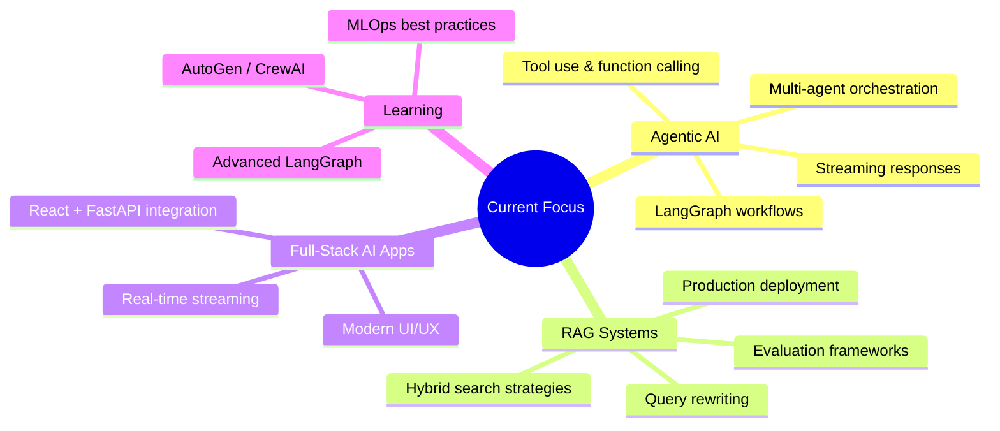

# 👋 Hi, I'm Youssef Ennagui

<div align="center">

[](https://git.io/typing-svg)

</div>

---

## 🚀 About Me

I'm a passionate **AI & Machine Learning Engineer** and **Full-Stack Developer** specializing in **Agentic AI Systems**, **RAG Applications**, and **LLM-Powered Solutions**. I build intelligent systems that can reason, plan, and execute complex tasks autonomously.

```python
class YoussefEnnagui:
    def __init__(self):
        self.role = "AI/ML Engineer & Full-Stack Developer"
        self.specialization = ["Agentic AI", "RAG Systems", "LLM Apps", "Computer Vision", "NLP"]
        self.current_focus = "Building production-ready agentic AI systems"
        self.motto = "Making AI accessible, autonomous, and impactful"
    
    def tech_stack(self):
        return {
            "languages": ["Python", "JavaScript", "TypeScript", "Java", "R", "Kotlin"],
            "ai_ml": ["PyTorch", "TensorFlow", "LangChain", "LangGraph", "AutoGen", "CrewAI", "LlamaIndex", "Ollama", "HuggingFace"],
            "backend": ["FastAPI", "Flask", "Laravel", "Spring Boot", "Node.js"],
            "frontend": ["React", "Vue.js", "JSP", "HTML/CSS", "Tailwind"],
            "databases": ["PostgreSQL", "MongoDB", "Redis", "Pinecone", "Weaviate", "ChromaDB"],
            "mlops": ["MLflow", "DVC", "Docker", "Kubernetes", "GitHub Actions"],
            "cloud": ["AWS", "GCP", "Azure"],
            "tools": ["Git", "VS Code", "Jupyter", "Groq", "Tavily"]
        }
```

---

## 🎯 Featured Projects

### 🤖 Agentic AI & LLM Applications

| Project | Description | Tech Stack | Stars | Updated |
|---------|-------------|------------|-------|---------|
| **[Agentic-Chat](https://github.com/ennaguiyoussef/Agentic-Chat)** | Intelligent web-based assistant with FastAPI backend, LangGraph agent workflow, Groq LLM, and Tavily search for real-time streaming responses | Python, FastAPI, LangGraph, Groq, Tavily, React | ⭐ 0 | Sep 2026 |
| **[langgraph-demo](https://github.com/ennaguiyoussef/langgraph-demo)** | LangGraph learning demo following Youssfi's YouTube tutorial - stateful agent workflows | Python, LangGraph, Jupyter | ⭐ 0 | Aug 2026 |
| **[simple_RAG](https://github.com/ennaguiyoussef/simple_RAG)** | Minimal from-scratch RAG chatbot with Python, Ollama, Flask, and React - perfect for learning RAG fundamentals | Python, Ollama, Flask, React | ⭐ 1 | May 2026 |
| **[LLM-Translator-Project](https://github.com/ennaguiyoussef/LLM-Translator-Project)** | English to Darija translator using LLM | JavaScript, LLM | ⭐ 0 | Feb 2026 |

### 🔬 Machine Learning & Data Science

| Project | Description | Tech Stack | Stars | Updated |
|---------|-------------|------------|-------|---------|
| **[AGTO](https://github.com/ennaguiyoussef/AGTO)** | Interactive dashboard (React/FastAPI) visualizing Artificial Gorilla Troops Optimizer for neural network training (Breast Cancer Classification) via PCA projection | React, FastAPI, Python, PCA, Meta-heuristics | ⭐ 0 | Aug 2026 |
| **[customers-churn-prediction](https://github.com/ennaguiyoussef/customers-churn-prediction)** | Customer churn prediction model | Python, Jupyter, Scikit-learn | ⭐ 0 | Aug 2026 |
| **[detector-spam](https://github.com/ennaguiyoussef/detector-spam)** | Web-based spam detection with Flask API, React frontend, FastText embeddings, and MLP classifier | Python, Flask, React, FastText, MLP | ⭐ 1 | May 2026 |
| **[ADM_Cardiovasculair_Disease](https://github.com/ennaguiyoussef/ADM_Cardiovasculair_Disease)** | Multiclass cardiovascular risk stratification using LDA in R with preprocessing, Fisher criterion, Bayesian decision rule | R, LDA, Statistics, LaTeX | ⭐ 1 | May 2026 |
| **[CodeAlpha_IrisClassification](https://github.com/ennaguiyoussef/CodeAlpha_IrisClassification)** | Iris flower classification project | Python, Jupyter, Scikit-learn | ⭐ 0 | Jul 2026 |
| **[100-days-of-code-python](https://github.com/ennaguiyoussef/100-days-of-code-python)** | 100 Days of Code: Complete Python Pro Bootcamp projects | Python, Jupyter | ⭐ 0 | Dec 2025 |

### 🌐 Full-Stack & Web Development

| Project | Description | Tech Stack | Stars | Updated |
|---------|-------------|------------|-------|---------|
| **[my-port-folio](https://github.com/ennaguiyoussef/my-port-folio)** | Personal portfolio website | JavaScript, HTML/CSS | ⭐ 0 | Nov 2025 |
| **[Compiler_Exemple](https://github.com/ennaguiyoussef/Compiler_Exemple)** | Online compiler with React and Laravel | React, Laravel, PHP | ⭐ 0 | Mar 2025 |
| **[machine_learning_api](https://github.com/ennaguiyoussef/machine_learning_api)** | API collection for ML projects | Python, FastAPI/Flask | ⭐ 0 | Jul 2026 |
| **[ennaguiyoussef.github.io](https://github.com/ennaguiyoussef/ennaguiyoussef.github.io)** | GitHub Pages portfolio site | HTML, CSS, JavaScript | ⭐ 0 | Jul 2026 |

### 📚 Learning & Tutorials

| Project | Description | Focus Area |
|---------|-------------|------------|
| **[TPs_Visuel_Analytics](https://github.com/ennaguiyoussef/TPs_Visuel_Analytics)** | Computer Vision Master's module practical works (WISD Fes) | Computer Vision, Image Processing |
| **[codealpha_tasks](https://github.com/ennaguiyoussef/codealpha_tasks)** | CodeAlpha internship tasks | Various ML/DL tasks |
| **[GeneriqueClasse_Lambda_Cours](https://github.com/ennaguiyoussef/GeneriqueClasse_Lambda_Cours)** | Java generics and lambda expressions course | Java, Generics, Lambdas |
| **[ThreadCoursTutoriel](https://github.com/ennaguiyoussef/ThreadCoursTutoriel)** | Advanced Java threading tutorial | Java, Concurrency, Threads |
| **[jsp_tutoriel](https://github.com/ennaguiyoussef/jsp_tutoriel)** | JSP (Java Server Pages) tutorial | Java, JSP, Servlets |
| **[XmlToJson](https://github.com/ennaguiyoussef/XmlToJson)** | XML to JSON converter | Java |
| **[swot](https://github.com/ennaguiyoussef/swot)** | University project (Sidi Mohamed Ben Abdellah) | Kotlin |
| **[PFE_SMI_S6](https://github.com/ennaguiyoussef/PFE_SMI_S6)** | Final year project (PFE) | Various |
| **[desktop-tutorial](https://github.com/ennaguiyoussef/desktop-tutorial)** | GitHub Desktop tutorial repository | Git, GitHub |

---

## 📊 GitHub Analytics

<div align="center">


</div>

---

## 🏆 Achievements & Highlights

<div align="center">


</div>

- 🤖 **Agentic AI** — Building autonomous systems with LangGraph, LangChain, AutoGen
- 🔍 **RAG Expertise** — From-scratch to production RAG implementations
- 🧠 **ML/DL** — PyTorch, Scikit-learn, Computer Vision, NLP, Meta-heuristics
- 🌐 **Full-Stack** — React, FastAPI, Flask, Laravel, Spring Boot
- 📚 **Continuous Learner** — 100 Days of Code, Master's in WISD, Multiple certifications

---

## 🛠️ Technical Expertise

### **AI/ML & Data Science**
```
🤖 Agentic AI / Multi-Agent     ███████████████████▌ 90%
🔍 RAG / Knowledge Retrieval    ███████████████████▌ 90%
🧠 LLMs / Prompt Engineering    ██████████████████▌  85%
📊 Computer Vision              ███████████████▌     75%
📈 Classical ML / Statistics    █████████████████▌   80%
🧮 Optimization / Meta-heuristics ███████████████▌   75%
```

### **Software Engineering**
```
🐍 Python                       ████████████████████ 95%
⚛️ React / Frontend             █████████████████▌   80%
⚡ FastAPI / Backend             █████████████████▌   85%
☕ Java / Spring / JSP           ███████████████▌     75%
🐘 PHP / Laravel                 ██████████████▌      70%
🔧 DevOps / MLOps               █████████████▌       65%
```

---

## 📈 Current Focus Areas



---

## 🤝 Let's Connect

<div align="center">

[](https://linkedin.com/in/ennaguiyoussef)
[](https://github.com/ennaguiyoussef)
[](mailto:youssef.ennagui@example.com)
[](https://ennaguiyoussef.github.io)

</div>

---

## 💡 Philosophy

> **"The best way to predict the future is to build it with AI."**

I believe in:
- 🔬 **Research-driven engineering** — Bridging cutting-edge research with production systems
- 🤝 **Open collaboration** — Sharing knowledge accelerates everyone's progress
- 🎯 **Pragmatic innovation** — Building solutions that solve real problems
- 📚 **Continuous learning** — The AI field moves fast; staying curious is essential

---

## 📬 Get In Touch

I'm always open to discussing:
- 🤖 **Agentic AI architecture** and multi-agent systems
- 🔍 **RAG systems** and knowledge-intensive applications
- 🧠 **ML/DL projects** — Computer Vision, NLP, Optimization
- 🌐 **Full-stack development** — React, FastAPI, Laravel, Spring
- 💼 **Collaborations, internships, or freelance projects**

<div align="center">

**⭐ Star my repositories if you find them useful!**

[](https://github.com/ennaguiyoussef)

</div>

---

<details>
<summary>🎉 Fun Facts</summary>

- 🎮 I gamify my learning — turning tutorials into portfolio projects
- ☕ Coffee-driven development: 3+ cups/day while coding
- 🌙 Night owl — best coding happens 10PM-2AM
- 🎵 Background music: Lo-fi beats or Hans Zimmer soundtracks
- 🏃‍♂️ Balance: Running clears my mind for better architectures
- 🇲🇦 Proud Moroccan developer building global AI solutions

</details>

---

<div align="center">

</div>