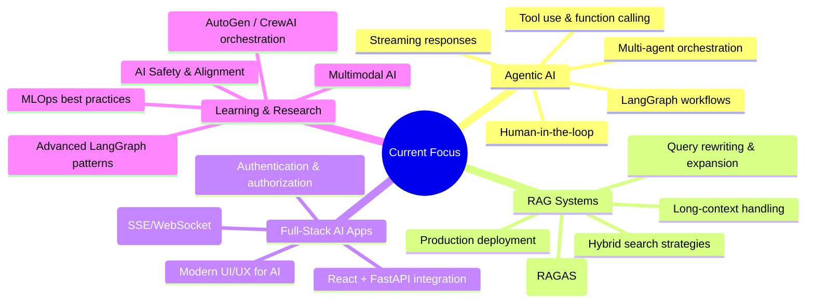

# 👋 Hi, I'm Youssef Ennagui

<div align="center">

[](https://git.io/typing-svg)

</div>

---

## 🚀 About Me

I'm a passionate **AI & Machine Learning Engineer** and **Full-Stack Developer** specializing in **Agentic AI Systems**, **RAG Applications**, and **LLM-Powered Solutions**. I build intelligent systems that can reason, plan, and execute complex tasks autonomously.

```python
class YoussefEnnagui:
    def __init__(self):
        self.role = "AI/ML Engineer & Full-Stack Developer"
        self.specialization = ["Agentic AI", "RAG Systems", "LLM Apps", "Computer Vision", "NLP"]
        self.current_focus = "Building production-ready agentic AI systems"
        self.motto = "Making AI accessible, autonomous, and impactful"
        self.education = "Master's WISD - Computer Vision & Data Science (USMBA, Fes)"
        self.location = "Morocco 🇲🇦"
    
    def tech_stack(self):
        return {
            "languages": ["Python", "JavaScript", "TypeScript", "Java", "R", "Kotlin", "SQL"],
            "ai_ml": ["PyTorch", "TensorFlow", "LangChain", "LangGraph", "AutoGen", "CrewAI", "LlamaIndex", "Ollama", "HuggingFace", "FastText", "Scikit-learn"],
            "backend": ["FastAPI", "Flask", "Laravel", "Spring Boot", "Node.js", "Express"],
            "frontend": ["React", "Vue.js", "JSP", "HTML/CSS", "Tailwind CSS", "Bootstrap"],
            "databases": ["PostgreSQL", "MongoDB", "Redis", "Pinecone", "Weaviate", "ChromaDB", "FAISS"],
            "mlops": ["MLflow", "DVC", "Docker", "Kubernetes", "GitHub Actions", "Prefect"],
            "cloud": ["AWS", "GCP", "Azure"],
            "tools": ["Git", "VS Code", "Jupyter", "Groq", "Tavily", "Postman", "Figma"]
        }
    
    def __repr__(self):
        return f"YoussefEnnagui(role='{self.role}', focus='{self.current_focus}')"
```

---

## 🎯 Featured Projects

### 🤖 Agentic AI & LLM Applications

| Project | Description | Tech Stack | Stars | Updated |
|---------|-------------|------------|-------|---------|
| **[Agentic-Chat](https://github.com/ennaguiyoussef/Agentic-Chat)** | Intelligent web-based assistant with FastAPI backend, LangGraph agent workflow, Groq LLM, and Tavily search for real-time streaming responses. Demonstrates agentic AI principles, tool calling, and modern full-stack integration. | `Python` `FastAPI` `LangGraph` `Groq` `Tavily` `React` `JavaScript` | ⭐ 0 | Sep 2026 |
| **[langgraph-demo](https://github.com/ennaguiyoussef/langgraph-demo)** | LangGraph learning demo following Youssfi's YouTube tutorial - stateful agent workflows and graph-based reasoning. | `Python` `LangGraph` `Jupyter` | ⭐ 0 | Aug 2026 |
| **[simple_RAG](https://github.com/ennaguiyoussef/simple_RAG)** | Minimal from-scratch RAG chatbot with Python, Ollama, Flask, and React - perfect for learning RAG fundamentals under the hood! | `Python` `Ollama` `Flask` `React` `JavaScript` | ⭐ 1 | May 2026 |
| **[LLM-Translator-Project](https://github.com/ennaguiyoussef/LLM-Translator-Project)** | English to Darija (Moroccan Arabic) translator using LLM - bridging language barriers with AI. | `JavaScript` `LLM` `API` | ⭐ 0 | Feb 2026 |

### 🔬 Machine Learning & Data Science

| Project | Description | Tech Stack | Stars | Updated |
|---------|-------------|------------|-------|---------|
| **[AGTO](https://github.com/ennaguiyoussef/AGTO)** | 🦍 **AGTO Field Station** - Interactive dashboard (React/FastAPI) visualizing Artificial Gorilla Troops Optimizer for neural network training (Breast Cancer Classification) via PCA projection. Novel meta-heuristic optimization! | `React` `FastAPI` `Python` `PCA` `Meta-heuristics` `Neural Networks` | ⭐ 0 | Aug 2026 |
| **[customers-churn-prediction](https://github.com/ennaguiyoussef/customers-churn-prediction)** | Customer churn prediction model with feature engineering, model selection, and evaluation. | `Python` `Jupyter` `Scikit-learn` `Pandas` `XGBoost` | ⭐ 0 | Aug 2026 |
| **[detector-spam](https://github.com/ennaguiyoussef/detector-spam)** | Web-based spam detection system combining Flask API, React frontend, FastText embeddings, and MLP classifier to identify messages as spam or ham. | `Python` `Flask` `React` `FastText` `MLP` `NLP` | ⭐ 1 | May 2026 |
| **[ADM_Cardiovasculair_Disease](https://github.com/ennaguiyoussef/ADM_Cardiovasculair_Disease)** | Multiclass cardiovascular risk stratification using Linear Discriminant Analysis (LDA) in R. Includes preprocessing, Fisher criterion, Bayesian decision rule, model evaluation, and LaTeX report. | `R` `LDA` `Statistics` `LaTeX` `Bayesian` | ⭐ 1 | May 2026 |
| **[CodeAlpha_IrisClassification](https://github.com/ennaguiyoussef/CodeAlpha_IrisClassification)** | Iris flower classification project - classic ML benchmark with multiple algorithms comparison. | `Python` `Jupyter` `Scikit-learn` `ML` | ⭐ 0 | Jul 2026 |
| **[100-days-of-code-python](https://github.com/ennaguiyoussef/100-days-of-code-python)** | 100 Days of Code: Complete Python Pro Bootcamp projects - daily coding practice and projects. | `Python` `Jupyter` `Bootcamp` | ⭐ 0 | Dec 2025 |

### 🌐 Full-Stack & Web Development

| Project | Description | Tech Stack | Stars | Updated |
|---------|-------------|------------|-------|---------|
| **[my-port-folio](https://github.com/ennaguiyoussef/my-port-folio)** | Personal portfolio website showcasing projects and skills. | `JavaScript` `HTML` `CSS` `Responsive` | ⭐ 0 | Nov 2025 |
| **[Compiler_Exemple](https://github.com/ennaguiyoussef/Compiler_Exemple)** | Online compiler with React frontend and Laravel backend - execute code in browser. | `React` `Laravel` `PHP` `Docker` | ⭐ 0 | Mar 2025 |
| **[machine_learning_api](https://github.com/ennaguiyoussef/machine_learning_api)** | API collection for ML projects - standardized endpoints for model serving. | `Python` `FastAPI` `Flask` `REST` | ⭐ 0 | Jul 2026 |
| **[ennaguiyoussef.github.io](https://github.com/ennaguiyoussef/ennaguiyoussef.github.io)** | GitHub Pages portfolio site - live at [ennaguiyoussef.github.io](https://ennaguiyoussef.github.io) | `HTML` `CSS` `JavaScript` `GitHub Pages` | ⭐ 0 | Jul 2026 |

### 📚 Learning & Tutorials

| Project | Description | Focus Area |
|---------|-------------|------------|
| **[TPs_Visuel_Analytics](https://github.com/ennaguiyoussef/TPs_Visuel_Analytics)** | Computer Vision Master's module practical works (WISD Fes, USMBA) | Computer Vision, Image Processing, OpenCV |
| **[codealpha_tasks](https://github.com/ennaguiyoussef/codealpha_tasks)** | CodeAlpha internship tasks - various ML/DL projects | ML/DL, Python, Practical Applications |
| **[GeneriqueClasse_Lambda_Cours](https://github.com/ennaguiyoussef/GeneriqueClasse_Lambda_Cours)** | Java generics and lambda expressions course | Java, Generics, Lambdas, Functional Programming |
| **[ThreadCoursTutoriel](https://github.com/ennaguiyoussef/ThreadCoursTutoriel)** | Advanced Java threading tutorial | Java, Concurrency, Threads, Multithreading |
| **[jsp_tutoriel](https://github.com/ennaguiyoussef/jsp_tutoriel)** | JSP (Java Server Pages) tutorial | Java, JSP, Servlets, Web Development |
| **[XmlToJson](https://github.com/ennaguiyoussef/XmlToJson)** | XML to JSON converter utility | Java, XML, JSON, Data Transformation |
| **[swot](https://github.com/ennaguiyoussef/swot)** | University project (Sidi Mohamed Ben Abdellah) | Kotlin, Android, Mobile Development |
| **[PFE_SMI_S6](https://github.com/ennaguiyoussef/PFE_SMI_S6)** | Final year project (PFE) - Master's thesis | Research, AI/ML, Full-Stack |
| **[desktop-tutorial](https://github.com/ennaguiyoussef/desktop-tutorial)** | GitHub Desktop tutorial repository | Git, GitHub, Version Control |

---

## 📊 GitHub Analytics

<div align="center">


</div>

---

## 🏆 Achievements & Highlights

<div align="center">


</div>

### 🎖️ Badges & Recognition

- 🤖 **Agentic AI Pioneer** — Early adopter of LangGraph, AutoGen, CrewAI for production systems
- 🔍 **RAG Expert** — From-scratch to production RAG implementations with evaluation frameworks
- 🧠 **ML/DL Practitioner** — PyTorch, Scikit-learn, Computer Vision, NLP, Meta-heuristics optimization
- 🌐 **Full-Stack Developer** — React, FastAPI, Flask, Laravel, Spring Boot, Modern Web Stack
- 📚 **Lifelong Learner** — 100 Days of Code, Master's WISD, Multiple certifications & tutorials
- 🇲🇦 **Moroccan Tech Talent** — Building global AI solutions from Morocco

---

## 🛠️ Technical Expertise

### **AI/ML & Data Science**
```
🤖 Agentic AI / Multi-Agent     ███████████████████▌ 90%
🔍 RAG / Knowledge Retrieval    ███████████████████▌ 90%
🧠 LLMs / Prompt Engineering    ██████████████████▌  85%
📊 Computer Vision              ███████████████▌     75%
📈 Classical ML / Statistics    █████████████████▌   80%
🧮 Optimization / Meta-heuristics ███████████████▌   75%
📝 NLP / Text Processing        ███████████████▌     75%
🏷️ Model Deployment / MLOps     █████████████▌       65%
```

### **Software Engineering**
```
🐍 Python                       ████████████████████ 95%
⚛️ React / Frontend             █████████████████▌   80%
⚡ FastAPI / Backend             █████████████████▌   85%
☕ Java / Spring / JSP           ███████████████▌     75%
🐘 PHP / Laravel                 ██████████████▌      70%
🟢 Node.js / Express             █████████████▌       65%
🔧 DevOps / MLOps               █████████████▌       65%
🗄️ Databases / Vector Stores    █████████████▌       70%
```

---

## 📈 Current Focus Areas



---

## 🤝 Let's Connect

<div align="center">

[]([https://linkedin.com/in/ennaguiyoussef](https://www.linkedin.com/in/youssef-ennagui-b1862b37a/))
[](https://github.com/ennaguiyoussef)
[](mailto:youssefennagui2003@gmail.com)
[](https://ennaguiyoussef.github.io)
[](https://twitter.com/ennaguiyoussef)

</div>

---

## 💡 Philosophy

> **"The best way to predict the future is to build it with AI."**

I believe in:
- 🔬 **Research-driven engineering** — Bridging cutting-edge research with production systems
- 🤝 **Open collaboration** — Sharing knowledge accelerates everyone's progress
- 🎯 **Pragmatic innovation** — Building solutions that solve real problems
- 📚 **Continuous learning** — The AI field moves fast; staying curious is essential
- 🌍 **Global impact** — Technology should transcend borders and empower everyone

---

## 📬 Get In Touch

I'm always open to discussing:

- 🤖 **Agentic AI architecture** and multi-agent systems
- 🔍 **RAG systems** and knowledge-intensive applications
- 🧠 **ML/DL projects** — Computer Vision, NLP, Optimization, Meta-heuristics
- 🌐 **Full-stack development** — React, FastAPI, Laravel, Spring, Modern Web
- 💼 **Collaborations, internships, research positions, or freelance projects**
- 🎓 **Mentorship** — Helping others break into AI/ML

<div align="center">

**⭐ Star my repositories if you find them useful!**

[](https://github.com/ennaguiyoussef)

</div>

---

<details>
<summary>🎉 Fun Facts About Me</summary>

- 🎮 I **gamify my learning** — turning tutorials into portfolio projects
- ☕ **Coffee-driven development**: 3+ cups/day while coding
- 🌙 **Night owl** — best coding happens 10PM-2AM
- 🎵 **Background music**: Lo-fi beats or Hans Zimmer soundtracks
- 🏃‍♂️ **Balance**: Running clears my mind for better architectures
- 🇲🇦 **Proud Moroccan developer** building global AI solutions
- 📖 **Avid reader** — AI papers, sci-fi, and philosophy
- 🤝 **Community builder** — Love organizing study groups and hackathons

</details>

---

<details>
<summary>📜 Certifications & Courses</summary>

- ✅ **100 Days of Code: The Complete Python Pro Bootcamp** (Udemy)
- ✅ **LangGraph & LangChain** - Multiple tutorial series & hands-on projects
- ✅ **Computer Vision Master's Module** (WISD, USMBA Fes)
- ✅ **Agentic AI / RAG** - Self-study & project-based learning
- 🔄 **Currently exploring**: AutoGen, CrewAI, MLOps, AI Safety

</details>

---

<div align="center">

### 📊 Repository Summary

| Category | Count | ⭐ Stars |
|----------|-------|---------|
| **Agentic AI / LLM** | 4 | 1 |
| **Machine Learning / Data Science** | 6 | 2 |
| **Full-Stack / Web** | 4 | 0 |
| **Learning / Tutorials** | 9 | 1 |
| **Total Public Repos** | **16** | **4** |

---

### 🌟 Support My Work

If you find my projects helpful, consider:

- ⭐ **Starring** repositories you find useful
- 🍴 **Forking** and contributing improvements
- 🐛 **Reporting issues** or suggesting features
- 📢 **Sharing** with your network
- ☕ **Buying me a coffee** (link in bio)

[](https://buymeacoffee.com/ennaguiyoussef)

</div>

---

<div align="center">

</div>

---

<div align="center">
<sub>Last updated: September 2026 • Built with ❤️ by Youssef Ennagui • <a href="https://github.com/ennaguiyoussef">GitHub</a></sub>
</div>
